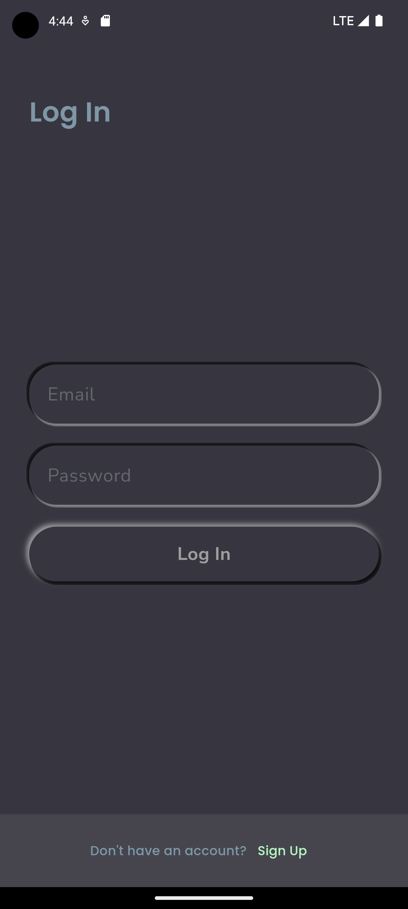
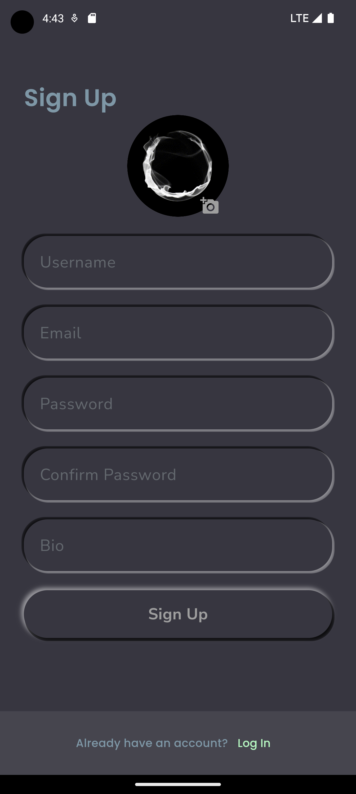

  <h1  style="font-size: 5rem;">Waveshotzz</h1>
  <h2>A Social Media App</h2>

Waveshotzz is a social networking app inspired by Instagram, showcasing clean architecture and Bloc pattern implementation.

## Features

- **Authentication**: Sign in, sign up, and sign out functionality.

  
   

- **User Profile**: View and interact with user profiles.
- **Social Interactions**: Follow, unfollow, like, and upload posts.
- **Graph Visualization**: Explore user networks in a graph.
- **Direct Messaging**: Send and receive private messages.
- **Explore Page**: Discover trending posts and users.

## Getting Started

1. Ensure Firebase is set up for both web and mobile in `firebase_options.dart`.
2. Run the app using `flutter run`.

## Project Structure

- **core**: Core functionalities and shared elements.

  - **constants**: Constants used throughout the app.
  - **error**: Definition of application-specific errors.
  - **shared**: Shared entities and models.
  - **usecase**: Definition of use case abstraction.

- **features**:
  - **authentication**: User authentication feature.
  - **user**: User-related functionalities.
  - **messaging**: Direct messaging feature.
  - **explore**: Explore page feature.
- **previous**: Legacy code from the MVC architecture.

## Legacy Code

The `legacy` folder contains code from previous versions of the application. This code follows the MVC (Model-View-Controller) architecture. While this code is no longer in active use, it is kept for reference and historical purposes. Please note that this code might not be up-to-date with the current application features and may lack recent bug fixes and improvements.

## Prerequisites

- Flutter
- Firebase account with web and mobile configurations

## Contributing

Contributions are welcome! Please check our [contribution guidelines](CONTRIBUTING.md).

## License

This project is licensed under the [MIT License](LICENSE.md).

## Acknowledgments

- Firebase for providing a reliable backend infrastructure.
- The Flutter and Bloc communities for valuable resources.
